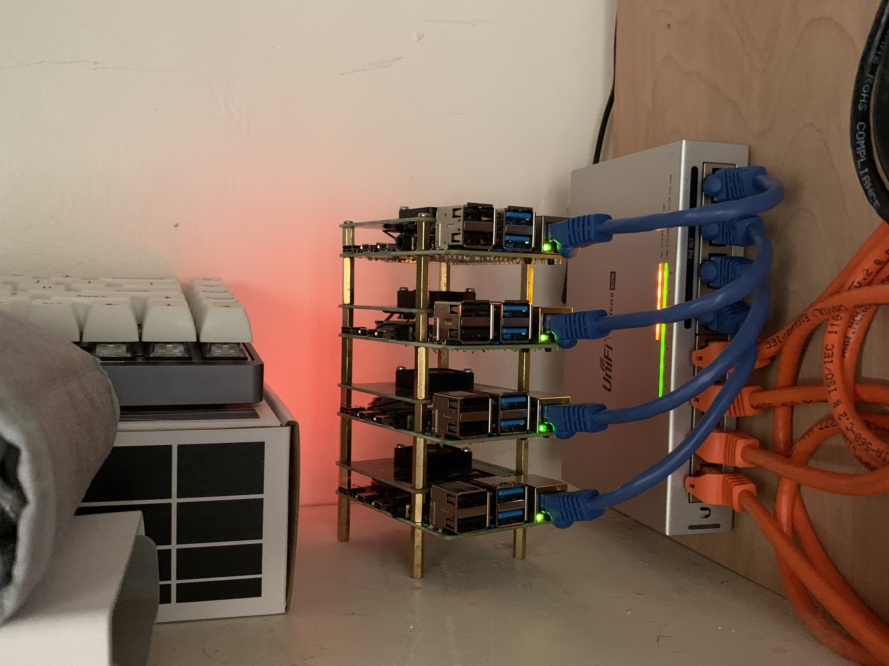

# Tiny Cluster

Hardware:
- 4 x **Raspberry Pi 4B 2GB RAM**
- 4 x **Raspberry Pi POE Hat**
- 1 x **Threaded stand-off kit**
- 4 x **6 inch CAT6A cables**
- **Managed POE switch**

## Todo

- [ ] More thorough documentation
- [ ] Add playbook for creating Nomad cluster

## Usage (to be embellished)

**Optional:** Build dedicated cluster network and configure routing, policies, and static DHCP leases.

Populate `ansible/inventory` with Pi IPs/FQDNs and NFS/TFTP server details.

Populate `ansible/vars/main.yml` with your project variables.

Using a raspbian-lite-loaded MicroSD card, boot up each Pi (can do one at a time) and run the `ansible/netboot.yml` playbook.

Power down or disconnect the nodes from the network and remove the MicroSD card(s).

On the host destined to be the TFTP, NFS, and build server, run `docker-compose.yml` to start the TFTP and NFS containers.

Additionally, on the same host, install [packer-builder-arm](https://github.com/mkaczanowski/packer-builder-arm).

Edit the DHCP options for the network that will contain the Pi nodes and specify the TFTP server's IP address.

Place base image for Pi nodes in `./images/`.

Edit each Packer `.json` template as desired.

Run the `ansible/deploy.yml` playbook.

Power up and connect the nodes to the network (bonus points given if you watch the PXE boot process via `tcpdump`).

Verify connectivity and SSH access to each node.

Run the `ansible/kubernetes.yml` playbook.

`kubectl get nodes`